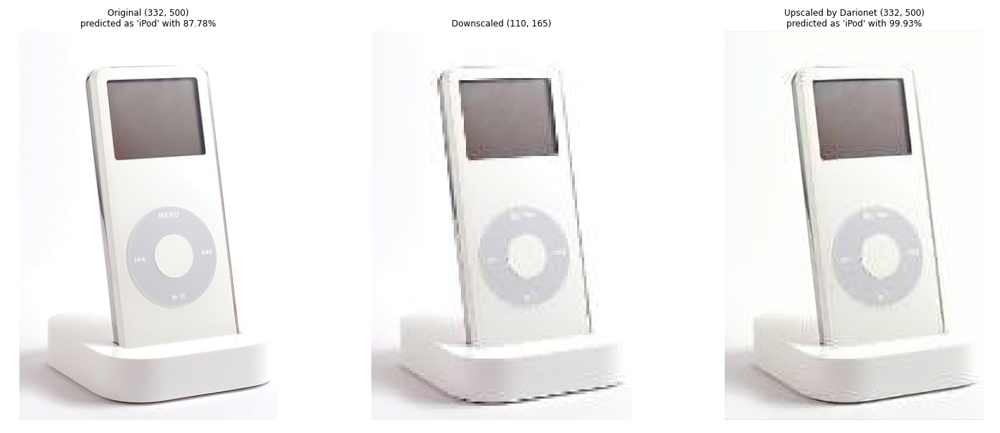

# Small Images Super Resolution for Classification

[](https://colab.research.google.com/drive/1SjIv-DGM3X2QDy1SY_hVz-hn75dqsYB_?usp=sharing)

## Overview

The project has been done by:

- [Riccardo Ceccaroni](https://github.com/ceccaroni1884368)
- [Simone Ercolino](https://github.com/Simonerc95)
- [Romeo Lanzino](https://github.com/rom42pla)
- [Dario Ruggeri](https://github.com/DarioRugg)

## Approach and methodologies


As it’s shown in the image the model pipeline is a sequence of:

1. A Scaler, a model that simply performs a downsampling of the image, reducing the image by one third of its original dimensions;
1. Then the little image is fed to DarioNet; a model obtained by the finetuning of the ESRGAN network on the ImageNet2012 dataset;
1. Finally the supersampled image coming out from DarioNet is directed to ResNet50 pre-trained in order to get the prediction for the reconstructed image.

The model is finetuned (only the DarioNet architecture) in a teacher-student framework where the loss is the MSE between the scores (before the softmax) of ResNet50 applied on the original image and the
scores oftthe same classifier applied on the reconstructed image.

Then the performances are evaluated on the test dataset to see how much our novel architecture lose in terms of classification accuracy

## Reproducibility
### The quick way: Google Colab
You can run an [interactive demo](https://colab.research.google.com/drive/1SjIv-DGM3X2QDy1SY_hVz-hn75dqsYB_?usp=sharing) in Google Colab just by clicking on the banner beneath the title of this README.

### The DIY way: run our code on your machine

#### Prepare the data
Firstly be sure to have the correct assets downloaded in the right places! 

Download the **ImageNet2012 training and validation datasets** from [ImageNet](www.image-net.org) and extract them into folders called `assets/ImageNet2012_train_original` and `assets/ImageNet2012_val_original`, then split the validation set in two halves running the script `img_sampler_val.py` and take only 15% of the train set by running the script `img_sampler_train.py`.
Be aware that **this dataset is not publicly available**, so you'll have to register to the website with your academic credentials to download it.

After this procedure, you should have a similar folder structure:

```
aml_project
    assets
        ImageNet2012_train_original
            n01440764
            n01443537
            ...
        ImageNet2012_val_original
            n01414164
            n01412039
            ...
        ImageNet2012_train
            n01440764
            n01443537
            ...
        ImageNet2012_val
            n01414164
            n01412039
            ...
        ImageNet2012_test
            n01414164
            n01412039
            ...
        models
            DarioNet.pt
            RRDB_PSNR_x4.pth
            RRDBNet_arch.py
    train_darionet.py
    test.py
    try_darionet.py
    ...
```

#### Tweak the parameters
File `parameters.json` contains the values for some parameters used in the scripts.

Those values are our configurations, so don't change them if you want to reproduce our exact results.

#### Test the model
You have two ways:

- run `try_darionet.py <img_path>` replacing the argument with the path of an image that you want to upscale and classify; this script will plot the image downscaled at different sizes and then reconstructed by DarioNet, with a final classification plot.
- run `test.py` to evaluate all the models on the test set and print results such as loss, PSNR, accuracy and time at the end 

Beware that ImageNet2012 has just 1000 labels that you can check into `assets/labels.json`.

#### Train the model
Just run `train_darionet.py`, follow the instructions in the script and wait an insane amount of time.

## Results

Since our main concern was to evaluate the possibility to make a successful (re-)classification after down-scaling, most of the metrics used are linked to Resnet50 predictions, which is indeed the true final stage of our end-to-end pipeline.


By looking in details at the performances we may have some more information about the difference in performances between the two architectures.

In these figures we can see how the two architectures behaves also considering the hardness of the classification class.

We can see that on average we have a worsening of the performances with DarioNet (we expect that since it works on images that are a third of the original ones) but we see also that we actually have some classes on which the novel network performs better than the old one.

From the 3D plot we can go further and see that the worsening, or the improvement, on performances seems to not depend on the difficulty of the class, a good sign.


### Super Resolution's results
Here you can find some examples of reconstructions using Darionet.

At the left is shown the original image in the center the downsampled and at the right the reconstructions.





## Resources
- [Brief report](https://github.com/rom42pla/aml_project/blob/main/report.pdf) of project's development and performances
- [Interactive demo](https://colab.research.google.com/drive/1SjIv-DGM3X2QDy1SY_hVz-hn75dqsYB_?usp=sharing) on Google Colab
